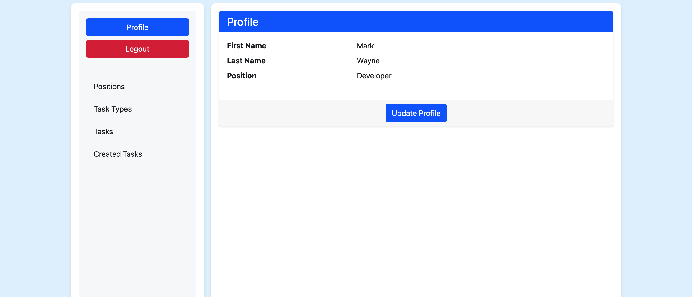

# Task Manager
## Models Overview
### Position
### Worker
### TaskType
### Task
## Additional Features
### Task Priority
Tasks can be categorized into four levels of priority (Critical, High, Medium, Low).

## Overview

### The application provides functionality for:

##### Managing tasks with deadlines, priorities, and assignment to workers.
##### Managing positions for workers.
##### Managing task types to categorize tasks.
##### Creating and updating worker profiles.
## Run this database
```
pip install -r requirements.txt
```
```
python manage.py migrate
```

link to deploy
https://task-manager-3mld.onrender.com

login: admin

password: admin

## images





